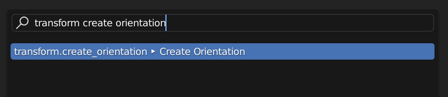
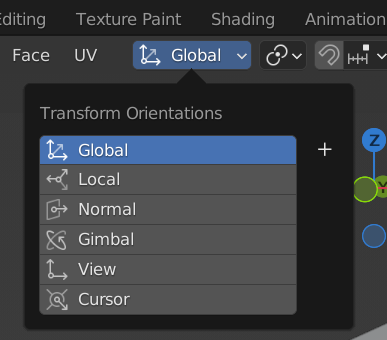
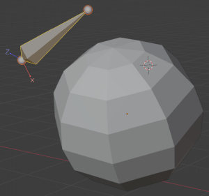
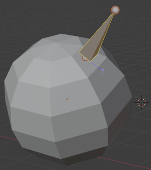
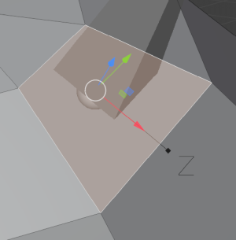

# Blender Scripts

Open `Python.blend` for an example Blender file that contains all scripts.

Supported version: Blender 3.3

## Operators

### Align Bone to Transform Orientation

Align bone to a *Custom Transform Orientation* and recalculate roll so that the bone Z axis points along the custom orientation X axis.

> Run the `op_align_bone_to_transform_orientation.py` script once to register the new "Align Bone to Transform Orientation" operation.

[op_align_bone_to_transform_orientation.py](op_align_bone_to_transform_orientation.py)

1. Go into *Edit Mode* (`Tab` when in *Object Mode*).

2. Switch to *Face Select* mode (`3`).

3. Select an object face.  

   

4. Create a *Custom Transform Orientation*.

   Two options:

   - Option 1: Open the command palette (Edit --> Menu Search or `F3`), type "transform create orientation" and execute the
     "Create Orientation" command. This will create a new *Custom Transform Orientation* called "Face" (by default) but
     *not* automatically select it.

     

   - Option 2: Open the "Transform Orientations" menu in the header of your 3D Viewport editor and click on the `+` button.
     This will create a new *Custom Transform Orientation* called "Face" (by default) and automatically select it.

     

5. If your new *Custom Transform Orientation* isn't already selected: Open the "Transform Orientations" menu
   in the header of your 3D Viewport editor and select "Face" at the bottom. ("Face" is the default name if
   this was the first manually created custom orientation.)

   

6. Snap (`Shift+S`) --> Cursor to Selected

   

7. Select an existing armature and enter *Edit Mode*.

8. Either add a new bone or select an existing bone.

   

9. Open the command palette (`F3`) and type "Align Bone to Transform Orientation".  
   Or: Right click the bone in *Edit Mode* and select the same operation.

10. Now the bone sits orthogonal on the selected face and is rolled in a way that its Z axis points along the X axis of the
    *Custom Transform Orientation*.

    

    

11. The newly created "Face" orientation can now be deleted.

## Test Scripts

Just a couple of test scripts.

### [test_move_cursor.py](test_move_cursor.py)

Get location of a vertex and move cursor to Z +1 in local space.

### [test_object_info.py](test_object_info.py)

Show object info and convert vertex coordinates between local and global space.
