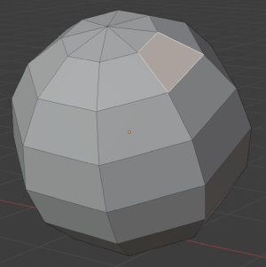
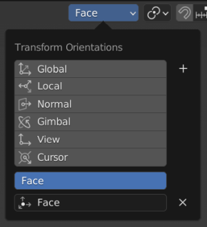
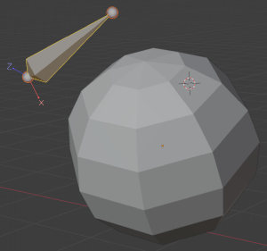
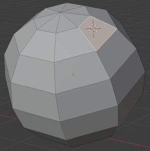

# Blender Scripts

## Operators

### Align Bone to Transform Orientation

Align bone to a custom transform orientation and recalculate roll so that the bone Z axis points along the custom orientation X axis.

[op_align_bone_to_transform_orientation.py](op_align_bone_to_transform_orientation.py)

- Select object face.  
  

- Create custom transform orientation ("Face" in this case) and keep it selected.  
  

- Snap (Shift-S) --> Cursor to Selected  
  

- Enter armature Edit Mode.  
  

- Either add a new bone or select an existing bone.  
  

- F3 --> "Align Bone to Transform Orientation"  
  

Now the bone sits orthogonal on the selected face and is rolled in a way that its Z axis points along the X axis of the custom transform orientation.

## Test Scripts

Just a couple of test scripts.

### [test_move_cursor.py](test_move_cursor.py)

Get location of a vertex and move cursor to Z +1 in local space.

### [test_object_info.py](test_object_info.py)

Show object info and convert vertex coordinates between local and global space.
